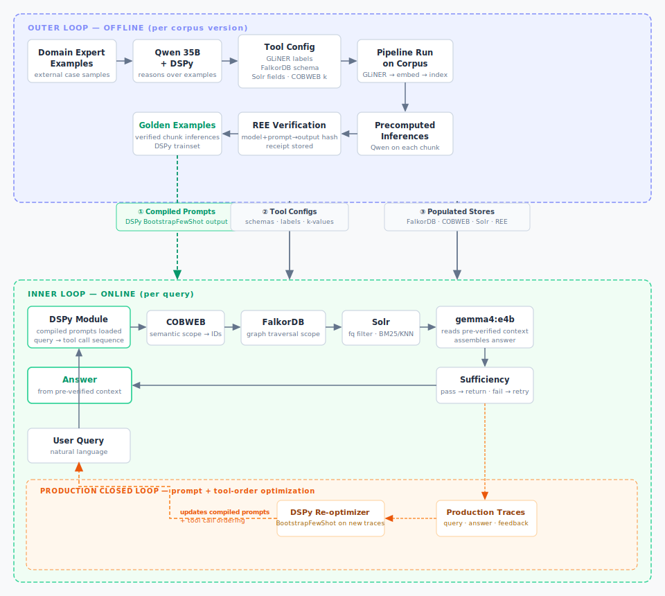

# OVIR — Offline Verified Inference Retrieval

## Overview
OVIR is a fast, locally hosted two-loop retrieval architecture designed for verified inference. It splits the heavy lifting of unstructured text processing into an expensive offline "outer loop" and serves rapid, highly-scoped queries in an online "inner loop."

Full design rationale: [`concept.md`](concept.md).

**Repository Stats:** ~6,000 lines of Python code, organized into a packaged `src/ovir/` library, self-contained component playgrounds, a unified pipeline, and a KG research subproject. All models run locally via Ollama with zero cloud dependencies.

## Architecture



**Outer loop** (offline, runs per corpus version): 
GLiNER entity extraction → FalkorDB graph build → COBWEB embedding index → Solr schema + indexing → DSPy trace generation via `qwen3.6:35b-mlx`. Ray parallelises the per-chunk extraction and embedding steps.

**Inner loop** (per query): 
COBWEB scope → FalkorDB graph traversal → Solr `fq` pre-filter → BM25 or KNN search → `gemma4:e4b` reads only scoped candidates → sufficiency check → escalate or return.

## Models

| Role | Model | When |
|---|---|---|
| Inner loop LM | `gemma4:e4b` | Every query |
| Outer loop LM | `qwen3.6:35b-mlx` | Corpus prep, DSPy trace generation |
| Embeddings | `nomic-embed-text` | COBWEB index, Solr KNN |

All three already in `ollama ls`. No pulls needed.

## Package: `src/ovir/`

The `src/ovir/` package contains the production-ready implementations of each loop, organized as importable modules.

### `src/ovir/offline/pipeline.py`
Ray-powered outer loop using stateful Actors. Three concurrent sinks — `FalkorActor`, `SolrActor`, `CobwebActor` — receive processed chunks from stateless `process_chunk` workers that run GLiNER + embedding in parallel.

```python
from ovir.offline.pipeline import run_pipeline
from pathlib import Path
run_pipeline(Path("data/cfpb_corpus.jsonl"), limit=500)
```

### `src/ovir/runtime/query.py`
DSPy-based `OnlineRuntime`. Loads the COBWEB retriever pickle, runs hybrid Solr search (30% BM25 + 70% KNN) scoped to COBWEB clusters, and assembles the answer via `OVIRQueryModule`.

```python
from ovir.runtime.query import OnlineRuntime
rt = OnlineRuntime()
trace = rt.query("What is ACME Corp's liability cap?", top_k=3)
# Returns: entities, answer, is_sufficient, latency_ms, scope sizes
```

### `src/ovir/eval/synthesize.py`
Synthetic eval dataset generator. Uses `qwen3.6:35b-mlx` (outer loop LM) to produce `(question, expected_entities, expected_answer)` triples from corpus chunks. Output drives DSPy optimization.

```python
from ovir.eval.synthesize import generate_synthetic_dataset
generate_synthetic_dataset(corpus_chunks, output_path="synthetic_eval.json")
```

---

## Running on real data

The `pipeline/` folder wires all components together into a single outer loop run against the CFPB corpus (`data/cfpb_corpus.jsonl`, 5000 synthetic complaint records).

```bash
# Prerequisites: FalkorDB running, Solr on :8983, Ollama running
cd pipeline
uv run 01_outer_loop.py              # GLiNER → embed → FalkorDB + COBWEB + Solr (100 chunks)
uv run 01_outer_loop.py --chunks 500 # larger run
uv run 02_query.py                   # COBWEB scope + FalkorDB traversal + Solr BM25/KNN
```

Expected outer loop timing at 100 chunks: ~15–25s total (GLiNER ~5s, embed ~2s, FalkorDB ~8s, Solr ~1s).

## Playgrounds

Each subfolder is a self-contained `uv` environment. Run scripts with `uv run <script>.py`. See the `NOTES.md` in each folder for gotchas discovered during testing.

### `falkordb-playground/`
Entity-chunk graph. Cypher queries, variable-length traversal, OVIR scope pattern.
```bash
# FalkorDB already running (existing container)
uv run 01_basics.py
uv run 02_traversal.py
uv run 03_ovir_pattern.py
uv run 04_index_and_performance.py
```

### `gliner-playground/`
Zero-shot NER with domain-specific label sets. Produces entity annotations and co-occurrence pairs for FalkorDB ingestion.
```bash
uv run 01_basics.py        # extraction, threshold comparison, latency
uv run 02_batch_corpus.py  # batch extraction → annotated_corpus.jsonl + entity_registry.json
```
Note: `batch_predict_entities` is deprecated upstream; replacement is `GLiNER.inference`.

### `cobweb-playground/`
Semantic routing via `CobwebRetriever` over nomic-embed-text embeddings. Produces chunk ID scope for Solr `fq`.
```bash
uv run 01_basics.py        # build retriever, query, cohesion check
uv run 02_ovir_routing.py  # offline build + pickle, online query → scope IDs
```
Note: `query()` returns `list[str]`, not `(score, text)` tuples. `concept-formation` caps at `0.3.9`.

### `solr-playground/`
Keyword search, scoped `fq` queries, faceting, atomic updates. Solr 10.0.0.
```bash
docker compose up -d
uv run 01_schema_and_index.py   # adds copyField chunk_text → _text_ (required for keyword search)
uv run 02_search.py
uv run 03_updates_and_management.py
```

### `solr-nn-playground/`
Dense vector search via `DenseVectorField` (768 dims, cosine). Scoped KNN and hybrid BM25+KNN. Runs on `:8984` to avoid conflict with `solr-playground`. Solr 10.0.0.
```bash
docker compose up -d
uv run 01_vector_index.py
```
Note: index corpus docs with explicit `chunk_id` field; pysolr returns stored text fields as single-element lists in Solr 10.

### `dspy-playground/`
DSPy v3 signatures, modules, and BootstrapFewShot optimization. Teacher (`qwen3.6:35b-mlx`) generates traces; student (`gemma4:e4b`) is compiled with them baked in.
```bash
uv run 01_signatures.py  # inline + class-based signatures, ChainOfThought, inspect_history
uv run 02_modules.py     # OVIRQueryModule: extract → route → assess sufficiency
uv run 03_optimizer.py   # teacher/student split, compile → compiled_router.json
```

### `qwen-playground/`
Inner and outer loop via Ollama's OpenAI-compatible endpoint. Entity extraction, thinking mode, JSON output, latency benchmark. All access via Ollama — no HuggingFace downloads.
```bash
uv run 01_ollama_basics.py
```

### `ray-playground/`
Parallel outer loop execution. `@ray.remote` functions for per-chunk GLiNER + embed, stateful Actors for FalkorDB/Solr/COBWEB sinks.
```bash
uv run 01_ray_basics.py         # sequential vs parallel: 8s → 1.6s
uv run 02_ray_actors.py         # stateful Actor pattern, proper future collection
uv run 03_ovir_ray_pipeline.py  # 50-chunk outer loop sim, ~24 chunks/s
```
Note: `ray.init(runtime_env={"excludes": [".venv/", "pyproject.toml", "uv.lock"]})` is required to prevent per-worker dep reinstall.

### `kg-linkedin-research/`
Research subproject: KG-augmented LLM reasoning over LinkedIn Economic Graph data. Goal is to match large-model QA quality on multi-hop career/skills queries using a small LM + graph embeddings, without fine-tuning weights.

Stack: DGL-KE (RotatE embeddings over `(member, relation, entity)` triples) → PyKEEN for link prediction baselines → GSR retriever → DSPy GEPA optimization for the inference-time module.

Key files:
- `PLAN.md` — step-by-step pipeline from raw TSV triples to optimized DSPy module
- `convert_to_kg.py` — ETL from O*NET/LinkedIn data formats to DGL-KE triple format
- `train_kg.sh` — DGL-KE training invocation (RotatE, 256d, on sample graph)
- `pykeen.md` — notes on PyKEEN link prediction baselines
- `data_sources.md` — data sourcing and licensing notes

```bash
cd kg-linkedin-research
python convert_to_kg.py        # ETL raw data → train/valid/test TSVs
bash train_kg.sh               # train RotatE embeddings
```

Note: `dglke` installed from source via `pyproject.toml` uv source entry (`awslabs/dgl-ke`). Requires PyTorch; use `DGLBACKEND=pytorch`.

### `gensyn-playground/`
Gensyn REE verifiable inference. Run/verify subprocess wrapper and receipt analysis stub.
```bash
# Requires gensyn-ree Docker image
uv run 01_run_and_receipt.py
uv run 02_receipt_analysis.py   # no Docker needed (uses stub receipts)
```

### `pipeline/`
End-to-end outer loop on real CFPB data. Ties all components together: GLiNER → nomic embed → FalkorDB graph + COBWEB retriever + Solr index. Then inner loop query test with COBWEB scope + FalkorDB traversal + Solr BM25/KNN.
```bash
uv run 01_outer_loop.py   # builds all three indexes from cfpb_corpus.jsonl
uv run 02_query.py        # tests retrieval against the built index
```

## Stack dependencies

| Component | Purpose | Port |
|---|---|---|
| FalkorDB | Entity-chunk graph, scope by traversal | 6379 / 3000 |
| Solr 10 (keyword) | BM25 search over scoped candidates | 8983 |
| Solr 10 (vectors) | KNN search, hybrid scoring | 8984 |
| Ollama | LM inference + embeddings (local) | 11434 |
| DGL-KE / PyKEEN | KG embedding training (`kg-linkedin-research`) | — |

FalkorDB and Ollama run as persistent containers. Solr instances are started per-playground via `docker compose`. DGL-KE and PyKEEN are Python-only; no service required.
