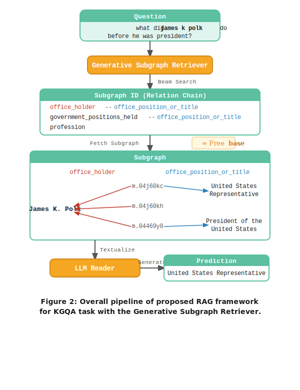

# KG-Augmented LLM Reasoning on LinkedIn Economic Graph

**Goal:** Run structured, multi-hop question answering over LinkedIn Economic Graph data using a small LLM, optimized to match larger model performance without fine-tuning weights.

**Stack:** Graph data → DGL-KE embeddings → GSR retriever → DSPy GEPA optimization

---

## Step 1: Set up the raw graph data

**Ref:** [PBG scoring / data model](https://torchbiggraph.readthedocs.io/en/latest/scoring.html)

The graph needs to be in TSV triple format: `(head, relation, tail)` per line. For LinkedIn Economic Graph this means ETL from the available data into:

```
member_id    has_skill           python
member_id    current_role        software_engineer
member_id    works_at            company_id
company_id   operates_in         fintech
skill_a      frequently_with     skill_b
```

Key decisions at this stage:

- **Split by time, not randomly.** Career graphs have temporal structure. Edges before 2023 = train, 2023 = val, 2024 = test. Random split leaks future information.
- **Relation design matters.** Each edge type becomes a learnable operator in the embedding model. Keep them semantically distinct: `has_skill` vs `past_role` vs `current_role` are different relations, not the same.
- **Entity set scope.** Start with a bounded subgraph — one job family or one skill cluster — rather than all 1.2B members. Validate the pipeline on a manageable slice first.

The PBG scoring doc describes the scoring function: each relation has an operator `g_r` applied to the RHS entity embedding, then compared to the LHS via a comparator (dot, cosine, L2). This is what DGL-KE implements. Understanding the math here tells you which model fits which relation type:
- **TransE / translation operator**: good for hierarchical, directional relations (A `reports_to` B)
- **RotatE / complex_diagonal**: good for symmetric and compositional patterns (skill co-occurrence, career transitions)
- **DistMult**: fast baseline, assumes symmetric relations — wrong for most career data

---

## Step 2: Embed the graph

**Repo:** [DGL-KE](https://github.com/awslabs/dgl-ke)

DGL-KE is the active, GPU-accelerated replacement for PBG. Trains TransE, TransR, DistMult, ComplEx, RotatE at scale. Benchmarked at 86M nodes / 338M edges in 100 minutes on 8 GPUs, or 30 minutes on a 4-machine cluster. 2–5× faster than PBG on the same hardware.

**Install:**
```bash
pip install dgl dglke
```

**Train RotatE on a custom TSV graph:**
```bash
DGLBACKEND=pytorch dglke_train \
  --model_name RotatE \
  --data_path ./data \
  --dataset linkedin_sample \
  --format raw_udd_hrt \
  --data_files train.tsv valid.tsv test.tsv \
  --batch_size 1000 \
  --neg_sample_size 200 \
  --hidden_dim 256 \
  --gamma 12.0 \
  --lr 0.1 \
  --max_step 100000 \
  --log_interval 1000 \
  --test \
  --num_thread 4 \
  --num_proc 4 \
  -adv
```

**Output:** Per-entity embedding vectors saved to `ckpt/`. These become the inputs to the retriever training step.

**Model choice for LinkedIn data:** RotatE. Career transitions and skill-to-role mappings have compositional, directional structure that RotatE's rotation-in-complex-space captures better than TransE. If compute is tight, DistMult as a fast baseline then RotatE to improve.

---

## Step 3: Train the generative subgraph retriever (GSR)

**Repo:** [GSR](https://github.com/hwy9855/GSR) — EMNLP Findings 2024

The key insight: separate retrieval from reasoning. Train a small model (220M–3B params) to output a **relation chain** (subgraph identifier) from a question. That chain gets used to fetch the relevant subgraph from the KG. A separate reader LLM then answers from the textualized subgraph.

The 220M retriever matches 7B-param models on retrieval quality. The 3B retriever + reader sets new SOTA on WebQSP and CWQ.



**How GSR represents subgraphs:** Each relation type in the graph becomes a special token in the retriever's vocabulary. The retriever is a seq2seq model trained to generate sequences of these tokens (relation chains) given a question. Beam search at inference time produces the top-k candidate chains, which are then used to walk the actual graph.

**Adapting GSR to LinkedIn Economic Graph:**

*Training data format:* GSR needs (question, gold relation chain) pairs. On standard KGQA benchmarks these come from annotated datasets. For LinkedIn data, generate synthetic QA pairs from the graph:
- Pick a target entity (e.g., a skill, a company)
- Walk back along known relation paths to construct a question ("What companies hire people with skill X and role Y?")
- The walked path is the gold relation chain

*Relation token vocabulary:* Replace WebQSP/CWQ Freebase relations with your LinkedIn relation types (`has_skill`, `works_at`, `current_role`, etc.). Each gets its own special token.

*Textualization for the reader:* After the retriever fetches the subgraph, convert it to natural language: "Alice worked at Stripe as a Software Engineer and has skills in Python and distributed systems." Feed this to the reader LLM.

---

## Step 4: Optimize with DSPy GEPA

**Ref:** [DSPy GEPA tutorial](https://dspy.ai/tutorials/gepa_facilitysupportanalyzer/)

GEPA is DSPy's reflective prompt optimizer. It uses a strong "reflection LLM" (e.g., GPT-5 or Claude Opus) to examine *why* the pipeline scored the way it did, then evolves the prompts of each DSPy module accordingly. The target model being optimized can be much smaller (the tutorial uses GPT-4.1 nano at ~75% baseline, reaching >85% after GEPA).

This is the "small LLM matches large LLM" mechanism: the reflection model's reasoning gets baked into the optimized prompts, which the small model then executes at inference time.

**DSPy program structure for this pipeline:**

```python
import dspy

class SubgraphRetriever(dspy.Module):
    """Wraps GSR: given a question, returns the relevant subgraph as text."""
    def __init__(self, gsr_model):
        self.gsr = gsr_model

    def forward(self, question: str) -> str:
        chains = self.gsr.retrieve(question, beam_size=5)
        subgraph = fetch_subgraph(chains)
        return textualize(subgraph)

class KGReader(dspy.Signature):
    """Answer a question given relevant knowledge graph context."""
    question: str = dspy.InputField()
    context: str = dspy.InputField(desc="relevant subgraph, textualized")
    answer: str = dspy.OutputField()

class KGQAPipeline(dspy.Module):
    def __init__(self, gsr_model):
        self.retriever = SubgraphRetriever(gsr_model)
        self.reader = dspy.ChainOfThought(KGReader)

    def forward(self, question: str):
        context = self.retriever(question=question)
        return self.reader(question=question, context=context)
```

**Optimization:**
```python
from dspy import GEPA

optimizer = GEPA(
    metric=your_metric_with_feedback,
    auto="heavy",           # use "light" for fast iteration
    num_threads=16,
    reflection_lm=dspy.LM("claude-opus-4-6", temperature=1.0)
)

optimized = optimizer.compile(
    KGQAPipeline(gsr_model),
    trainset=train_set,
    valset=val_set,
)
```

**Metric with feedback** (required for GEPA — it needs to know *why* a prediction failed, not just that it did):
```python
def metric_with_feedback(example, pred, trace=None, pred_name=None, pred_trace=None):
    score = exact_match(example.answer, pred.answer)
    feedback = (
        f"Correct answer: {example.answer}. "
        f"Predicted: {pred.answer}. "
        f"{'Correct.' if score else 'Incorrect — identify which relation in the subgraph was missed or misread.'}"
    )
    if pred_name is None:
        return score
    return dspy.Prediction(score=score, feedback=feedback)
```

GEPA will evolve the `KGReader` system prompt over iterations, incorporating domain-specific reasoning heuristics (e.g., "when the subgraph shows a `has_skill` → `works_at` chain, prefer companies where the skill appears in the majority of employee profiles"). These heuristics are generated by the reflection LLM, not hand-written.

---

## Open questions before starting

1. **Data access.** What slice of LinkedIn Economic Graph is available? Partnership program, public dataset, or synthetic? This determines entity count and relation coverage.
2. **Evaluation target.** Skill prediction? Next-company prediction? Salary inference from career path? The GSR training data format and the GEPA metric both depend on this.
3. **Entity stability.** Members churn, skill taxonomy evolves. Static KGE embeddings go stale. Decide upfront whether you're running a one-time experiment or need a live-updating graph.

---

## References

- [PBG scoring model](https://torchbiggraph.readthedocs.io/en/latest/scoring.html)
- [DGL-KE](https://github.com/awslabs/dgl-ke) — Zheng et al., SIGIR 2020
- [GSR: Less is More](https://arxiv.org/abs/2410.06121) — EMNLP Findings 2024 · [code](https://github.com/hwy9855/GSR)
- [DSPy GEPA tutorial](https://dspy.ai/tutorials/gepa_facilitysupportanalyzer/)
- [LinkedIn Economic Graph](https://economicgraph.linkedin.com/)
